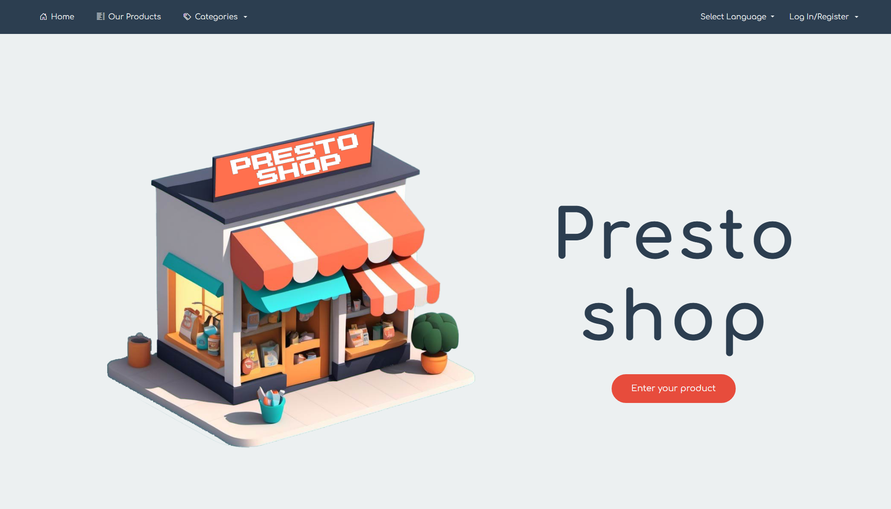

## Screenshot



---
# Presto Shop

Welcome to the **Presto Shop** project! This e-commerce platform is developed using **Laravel**, **Bootstrap 5.3**, **Bootstrap Icons**, and **Google AI Vision** to provide a seamless experience for buying and selling used items.

The application offers a comprehensive set of features, including a dedicated reviewer section, full CRUD functionality, multilingual support, and more.

---

## Key Features

- **E-commerce**: Facilitates buying and selling of used items.
- **CRUD Functionality**: Full management of ads, users, and categories.
- **Reviewer Page**: For approving or rejecting published ads.
- **Google AI Vision**: Utilized for analyzing and classifying uploaded images.
- **Login and Registration**: Secure user authentication system.
- **Advanced Form**: Dedicated module for ad submission.
- **Full Translation**: Multilingual support for enhanced accessibility.

---

## Technologies Used

### Backend:
- PHP 8.3
- Laravel 11
- Livewire

### Frontend:
- Bootstrap 5.3
- Bootstrap Icons

### AI:
- Google AI Vision

### Package Management:
- Node.js with npm

---

## System Requirements

- **PHP**: >= 8.3
- **Composer**: Installed on the system
- **Node.js**: >= 16.x
- **Database**: MySQL

---

## Installation and Setup

Follow these steps to clone and configure the project:

1. **Clone the repository**:
   ```bash
   git clone git@github.com:GioJourney/E-commerce-website.git
   ```

2. **Install PHP dependencies**:
   ```bash
   composer install
   ```

3. **Create the `.env` file and set your username and password in it**:
   ```bash
   cp .env.example .env
   ```

4. **Generate the application key**:
   ```bash
   php artisan key:generate
   ```

5. **Run migrations to create the database**:
   ```bash
   php artisan migrate
   ```

6. **Install JavaScript dependencies**:
   ```bash
   npm install
   ```

7. **Compile CSS and JavaScript files**:
   ```bash
   npm run dev
   ```

8. **Start the development server**:
   ```bash
   php artisan serve
   ```
9. **Start the jobs**:
   ```bash
   php artisan queue:work
   ```

Access the application by visiting [http://localhost:8000](http://localhost:8000) in your browser.

---

## Used Packages

- **google/cloud-vision**: ^1.10
- **laravel/fortify**: ^1.25
- **laravel/framework**: ^11.31
- **laravel/scout**: ^10.11
- **laravel/tinker**: ^2.9
- **livewire/livewire**: ^3.5
- **outhebox/blade-flags**: ^1.5
- **spatie/image**: ^3.7
- **teamtnt/laravel-scout-tntsearch-driver**: ^14.0

---

## Application Usage

1. **Homepage**:
   - View the most recent ads.

2. **Login and Registration**:
   - Log in or create an account to manage your ads.

3. **Ad Submission**:
   - Create a new ad by filling out the dedicated form.

4. **Reviewer Section**:
   - Administrators can approve or reject ads submitted by users.

---

## Developer Features

- **CRUD Management**: Easily add, edit, or delete ads, users, and categories.
- **Integration with Google AI Vision**: Analyze ad images to ensure compliance and quality.
- **Multilingual System**: All text is translated to support multiple languages.

---


## License

This project is released under the **MIT** license. See the `LICENSE` file for more details.

---

Thank you for choosing **Presto Shop**! If you have any questions or suggestions, feel free to contact me.

---
